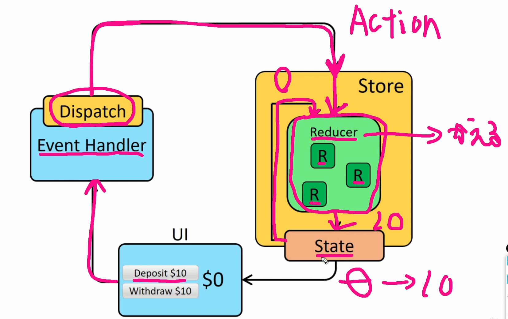

## Reduxについて

- Reduxとは
    状態管理のこと
    store -1か所で状態管理をすることで好きな場所からデータの受け渡しができるようになる

- 機能


- メリット
    保守性が保たれる
    管理がしやすくなる


## Reduxの仕組み

- state = 状態のこと
- UI = ボタン等のこと
- Event Handler = イベントを処理する
- Dispatch　= 通知を飛ばす
- Store = 状態管理しているところ
- Reducer = 変更する役割



## install
    React
    ```
    npx create-react-app appname
    ```
    Reduxは下記の2つインストール
    React-Redux
    ```
    npm install react-redux
    ```
    Redux
    ```
    npm i redux
    ```
    完成
    package.json
    ```   
　  "name": "first-redux-app",
　  "version": "0.1.0",
　  "private": true,
　  "dependencies": {
　    "@testing-library/jest-dom": "^5.17.0",
　    "@testing-library/react": "^13.4.0",
　    "@testing-library/user-event": "^13.5.0",
　    "react": "^18.2.0",
　    "react-dom": "^18.2.0",
　    "react-redux": "^9.1.1",
　    "react-scripts": "5.0.1",
　    "redux": "^5.0.1",
　    "web-vitals": "^2.1.4"
　  },
    ```
    
    またブラウザ(chrome)上でReduxを確認しやすくなるプラグインもインストール
    https://chromewebstore.google.com/detail/redux-devtools/lmhkpmbekcpmknklioeibfkpmmfibljd?hl=ja
    拡張するために上記をインストールしたあとに下記へアクセスし
    https://github.com/zalmoxisus/redux-devtools-extension

    一文をコピー
    ```
     window.__REDUX_DEVTOOLS_EXTENSION__ && window.__REDUX_DEVTOOLS_EXTENSION__()
    ```
    storeに第二引数として与えると確認する事が出来る
    ```
    const store = createStore(allReducers,window.__REDUX_DEVTOOLS_EXTENSION__ && window.__REDUX_DEVTOOLS_EXTENSION__())
    ```


## Reduxで必要なものを準備
- index.jsに記述していく
    Store
    actions -> increment(カウントアップ),decrement(カウントダウン)
    Reducer

- 1.actionを準備
    type(属性の名前)はなんでもいい
    "INCREMENT"(アクション名)は大文字で書くのが一般的
    UIを押したらアクションが発火する
    ```
    const increment = () =>{
        return{
          type:"INCREMENT",
        };
      };
    const decrement = () =>{
        return{
          type:"DECREMENT",
        };
      };
    ```
    Dispatchがstoreに対して通知を投げる時にどのアクションを通知するのかが判断できない為、アクション名を決めてあげる必要がある

- 2.reducerを準備
    前の状態(state)とactionを組み合わせて新しい状態に更新する仕組み
    swichcase文を使う
    最初の初期状態を宣言する(state=0,)
    第二引数にactionを指定する

    ```
      const counterReducer = (state = 0,action) =>{
        switch(action.type){
          case "INCREMENT":
            return state + 1;
          case "DECREMENT":
            return state - 1;
        }
      };
    ```
- 3.storeの準備
    Reducerやstateを含んだものがstoreとなる
    storeはReduxライブラリが用意してくれているcreatestoreを使う
    importをするが、Redux/toolkitに置き換わっている為、
    非推奨という意味で取り消し線が出ているが、
    今回は生のReduxを使う為、この状態で使っていく

    引数を取る必要があり、Reducerを取れば準備ができる

    ```
    import{ createStore} from "redux";

      let store = createStore(counterReducer)
    ```
- 4.Actionを通知するためのdispatchを準備
    先ほど作成したactionを関数の中に入れることでstoreに通知することができる
    ```
    store.dispatch(increment());
    ```  
## 流れ
    state=0は初期状態となり、カウントは0
    dispatchを呼びINCREMENTが通知される
    counterReducerをstoreの引数として取っている為、acitontypeはINCREMENTとなる
    return state +1 が裏側で動く
    結果　0 -> 1に変化する

- 数字を2に変化させるには
  dispatchを２回通知させる
  ２回目のdispatchは前の状態が1となっている為、
  (1) + 1 で2となる

  ```
  store.dispatch(increment());
  store.dispatch(increment());
  ```
  -1にするにはincrementをdecrementに変更するだけ

## index.jsに書かれたコードをリファクタリングして見やすくする
  - srcディレクトリの中にreducersとactionディレクトリを作成
    reducersディレクトリの中にcounter.js index.js isLoggin.jsを作成
    3つのファイルはreducerを作成する為のファイル
  - conter.jsを記述
  defaultはINCREMENT,DECREMENTのいずれにも当てはまらなかった場合、現在のstateを返す記述
  これがないとうまく動かない
  ```
  const counterReducer = (state=0,action)=>{
    switch(action.type){
        case "INCREMENT":
            return state + 1;
        case "DECREMENT":
            return state - 1;
        default:
            return state;
      }
    }
  export default counterReducer;
  ```
  - isLoggin.js
  stateは最初はfalse
  このisLogginReducerはユーザーがloginしているかどうかを切り替えるためのreducer
  actionによって切り替える仕組み
  action.typeがLOGINだった場合、今のstateの状態を反転させる
  ログインしてなかったらログインにする
  ```
  const isLogginReducer = (state=false,action)=>{
    switch(action.type){
        case "LOGIN":
            return !state;
        default:
            return state;
      }
  };
  export default isLogginReducer;
  ```

- storeの作成
  複数のReducerがある場合は、それらを組み合わせる関数がある
- 1.src配下のindex.jsにstoreの作成
  ```
  const store = createStore()
  ```
- 2.reducers配下のindex.jsに下記を記述
  combineReducersは複数のReducerをまとめる関数
  export default でstoreに引数で与えれる状態にする
  ```
  import { combineReducers } from "redux";
  import counterReducer from "./counter";
  import isLogginReducer from "./isLoggin";
  const allReducers = combineReducers({
    counter: counterReducer,
    isLogin:isLogginReducer
  })

  export default allReducers;
  ```
- 3.storeに引数を与える
  ```
  const store = createStore(allReducers)
  ```

## ProviderでグローバルにStoreを利用する
  storeをすべてのコンポーネントで使用する
  srcのindex,jsにてProviderでAppを包む
  何を渡すかstoreをpropsのような形で渡す
  そうすることでAppコンポーネントのすべてでstoreにアクセスする事が出来る
  storeが全てのコンポーネントで使用できる為、State(ログイン情報や数字など)も常に監視する事が出来る
  ```
  import { Provider } from 'react-redux';

    <React.StrictMode store={store}>
    <Provider>
    <App />
    </Provider>
  </React.StrictMode>
  ```

## useSelectorのHooksを使って状態にアクセスしよう
  srcのindex.jsのstoreにどうやってアクセスするのか
- 1.useSelectorを作成
  counterの状態を取得するためにcounterの変数を準備
  下記のコードでcounterの状態にアクセスする事が出来る
  state(今の状態)のcounterにアクセスしている
  アクセスはuseSelectorのhooksじゃないと出来ない
  ```
  const counter = useSelector((state) => state.counter)
  
  ```
  Login状態を取得
  ```
  const isLoggin = useSelector((state) => state.isLoggin);
  ```
  どこから取得しているか
  reducersフォルダのindex.js内にあるcombineReducersの指定したプロパティの値を取得している

  三項演算子とは
  isLoginがtrueであれば：より前を表示　falseであれば:以降が表示される
  ```
      {isLoggin ? <h3>ログインに成功</h3>:<h3>ログインしてください</h3>}
  ```

## 通知を出す為のactionを作成
- 1.actionフォルダのindex.jsに下記を記述
  ```
  export const increment = () =>{
    return{
        type:"INCREMENT",
    };
  };
  export const decrement = () =>{
    return{
        type:"DECREMENT",
    };
  };
  ```


## UI作成
- 1.button作成
  onClickの関数はuseDispatchを使用する
  useDispatchの使い方
  dispatch変数を準備　const dispatch = useDispatch();
  onClickのdispatch()の中にactionを入れる必要がある
  ```
  import { useDispatch, useSelector } from 'react-redux';

  const dispatch = useDispatch();


  <button onClick={()=>dispatch()}>+</button>
  ```
  actionを追加
  ```
  import { decrement, increment } from './actions';

  <button onClick={()=>dispatch(increment())}>+</button>
  
  ```
## actionについて
- actionはtypeだけじゃなくpayload(data)と呼ばれている属性プロパティを決めれる
action/index.js
```
export const increment = (Number) =>{
    return{
        type:"INCREMENT",
        payload:Number,
    };
};
```

dispatchで通知する際に引数(number)を指定出来る
結果引数で指定した数字だけ加算されていく
reducers/counter.js
```
        case "INCREMENT":
            return state + action.payload;
```


## App.jsが誤って削除され、復元したがエラーが発生
経緯
App.jsに記述している際にApp.1.jsが自動で作成(電球マークを押して発生)
App.1.jsを削除しApp.jsを復元しようとctrl+zで対応出来なかった為、手動で復元
その後下記エラーが発生
error内容
```
Uncaught runtime errors:
×
ERROR
Cannot access 'isLoggin' before initialization
ReferenceError: Cannot access 'isLoggin' before initialization
```
結果
useSelectorの記述が間違っており、state.isLogginの部分を,と間違えて記述
```
    const isLoggin = useSelector((state) => state,isLoggin);
```
